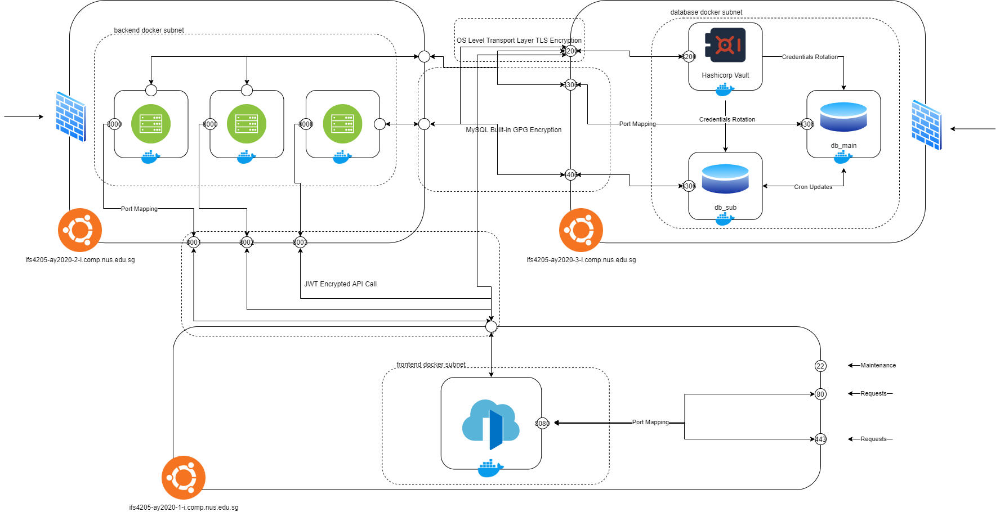
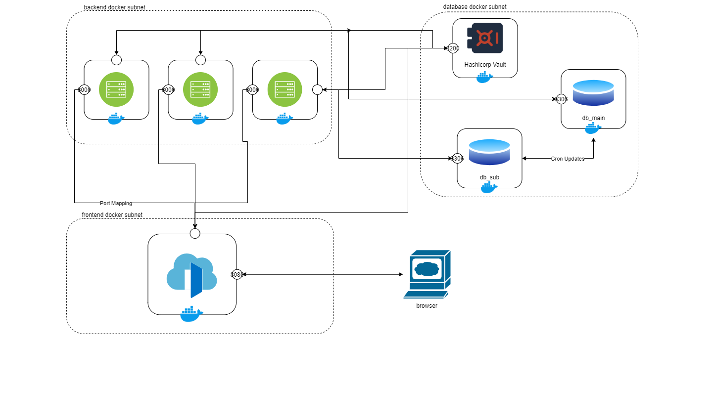

# Infrastructure Overview & Setup

### Overall System Architecture
Architecture photo for [Production](http://144.202.103.26/ifs4205/archi.png):


### I. Download Docker Desktop
[Docker](https://www.docker.com/products/docker-desktop)

### II. Download WSL (skip if using macOS)
1. Search for WSL in Microsoft Store
2. Install
3. Install Ubuntu 20.04 (or any version)
4. Open a WSL shell:
```
sudo nano /etc/wsl.conf

# Add the following to the file:
[automount]
root = /
options = "metadata"
```

### III. Set up docker environment
1. Install [Docker CE](https://www.docker.com/products/docker-desktop)
2. Install docker-compose:
```
pip3 install docker-compose
```
### IV. Create the infrastructure
```
source ./init.sh

# For first time / image rebuild required:
docker-compose -p infra --build up

# For normal devvelopment:
docker-compose -p infra up

# For testing:
docker ps
docker network ls
docker images
docker volume ls
```
Architecture photo for [Development](http://144.202.103.26/ifs4205/develop.png):


